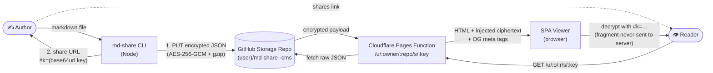
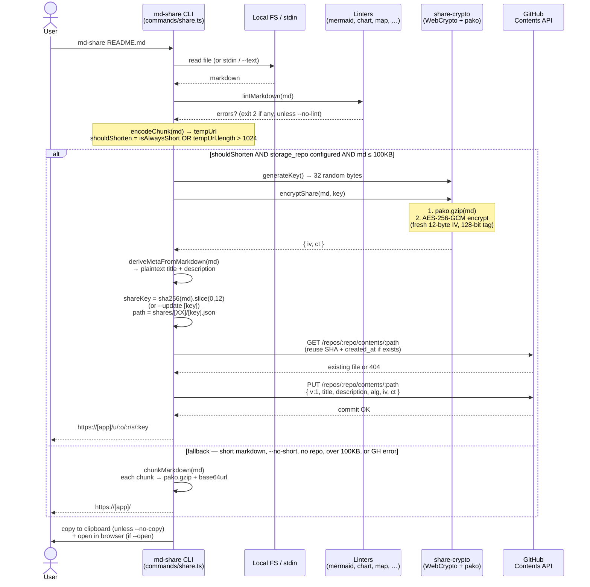
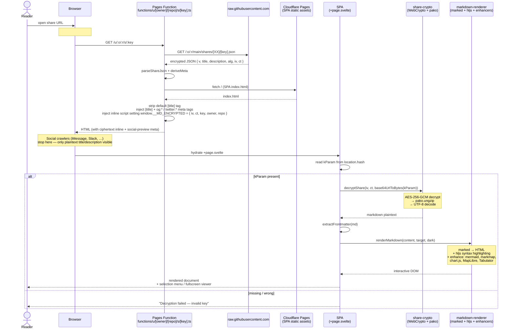
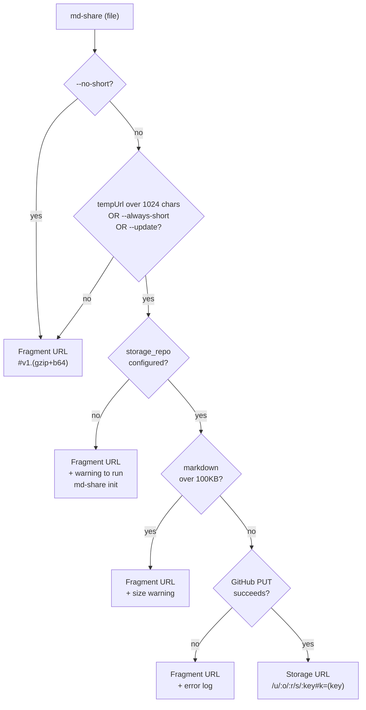
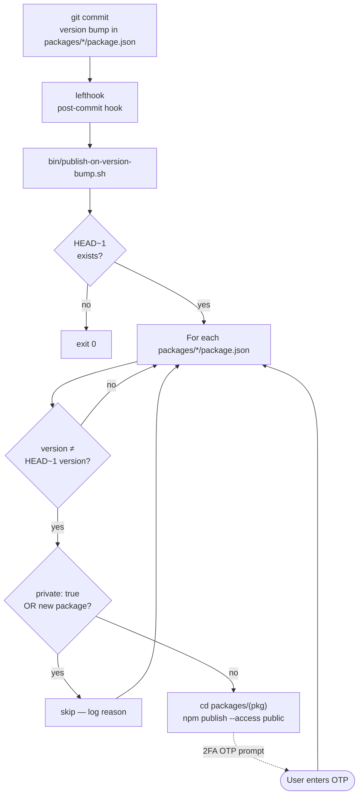

# md-share

Share encrypted markdown with rich interactive viewers — your own GitHub repo as the backend, no servers or KV.


*The SPA viewer rendering [`IMPLEMENTATION_PLAN.md`](IMPLEMENTATION_PLAN.md): auto-generated TOC sidebar, syntax-highlighted markdown body, and live reading stats — all hydrated client-side after AES-256-GCM decryption.*

---

## 1. Architecture



Every share is client-side encrypted before uploading. The cryptographic key is appended to the URL as a fragment identifier (`#k=<base64url_key>`). Because browsers do not transmit URL fragments to servers in HTTP requests, your markdown remains 100% private to you and whoever you share the link with.

See [§5 Data Flow](#5-data-flow) for step-by-step sequence diagrams of how the CLI publishes a share and how the reader decrypts and renders it.

---

## 2. Quickstart — Shared Canonical Deployment

Use the pre-deployed public client at `https://share.alanshum.org` to share your notes instantly. *Note: If the canonical URL currently serves legacy routes, it may require a manual Cloudflare Pages build trigger from the master branch to fully reflect the latest SPA.*

```bash
# 1. Install the CLI globally
npm install -g @alankyshum/md-share

# 2. Login to your GitHub account (authorizes via OAuth)
md-share login

# 3. Create your storage repository (e.g. <username>/md-share--cms)
md-share init

# 4. Share any markdown file!
md-share README.md
```

The CLI will encrypt the file, upload it as an idempotent JSON schema to your storage repo, and output a shareable URL similar to:
`https://share.alanshum.org/u/<owner>/<repo>/s/<key>#k=<base64url_key>`

---

## 3. Quickstart — Self-Hosting

Run your own SPA on Cloudflare Pages, sourced from your own fork of this repo. `md-share init --self-host` orchestrates the entire setup.

### Prerequisites

1. **GitHub** — already authenticated via `gh auth login` or via `md-share login`.
2. **`cf` Cloudflare CLI** — `brew install cloudflare/cloudflare/cf` (or download from https://github.com/cloudflare/cli/releases). See our `tool--cloudflare` skill for full reference.
3. **`CLOUDFLARE_API_TOKEN`** in your environment with `Account > Cloudflare Pages: Edit` scope. Mint at https://dash.cloudflare.com/profile/api-tokens.

### Setup

```bash
export CLOUDFLARE_API_TOKEN="..."
md-share init --self-host --project-name my-md-share
```

The wizard will:

1. Fork `alankyshum/md-share` to `<your-user>/md-share` (the app source).
2. Create your storage repo `<your-user>/md-share--cms` (the content source).
3. Use the `cf` CLI to create a Cloudflare Pages project linked to your app fork (production branch `master`, root dir `packages/md-share-app`, build command `pnpm install --frozen-lockfile && pnpm --filter @alankyshum/md-share-app build`, output `build`).
4. Wait for the first build and capture the resulting `<name>.pages.dev` subdomain.
5. Write the URL to `~/.config/md-share/config.json` as `app_base_url`.

### Updating

Your app fork tracks `alankyshum/md-share/master`. When you want upstream changes, sync your fork via the GitHub UI ("Sync fork" button on your fork's page) or `gh repo sync <your-user>/md-share`. Cloudflare Pages auto-rebuilds on each push to your fork's `master` branch.

---

## 4. Encryption Model

### Symmetric Encryption
- **AES-256-GCM** client-side encryption.
- **Initialization Vector (IV)**: 12 random bytes generated per file/share.
- **Secret Key**: 32 cryptographically secure random bytes generated locally.
- **Quantum Resistance**: Symmetric AES-256 is highly quantum-resistant; Grover’s algorithm reduces the security margin to a still-unbreakable 128 bits. Shor’s algorithm is not applicable to symmetric primitives.

### URL Fragment Security
The encryption key is stored in the URL fragment (`#k=<base64url>`). Because fragments are client-side only, they are never sent to Cloudflare, GitHub, or any intermediary servers. The SPA running in the user's browser reads the key from the fragment to decrypt the payload entirely client-side.

### Plaintext Metadata
To enable rich social previews (Open Graph) and CLI management commands (`list`, `search`), the **Title** and **Description** are saved as plaintext in the repository JSON. The markdown body, frontmatter, and assets are completely ciphertext. 
*Do not put highly confidential PII in your document titles or descriptions.*

### Password Derivation (PBKDF2)
Standard PBKDF2/password-based encryption is intentionally **not supported**. Secure, cryptographically random keys are generated to guarantee maximum entropy and prevent brute-force attacks.

---

## 5. Data Flow

### 5.1 Create — CLI publishes a new share

How `md-share <file>` turns a local markdown file into a shareable URL.



Key invariants:

- The 32-byte symmetric key **never leaves the author's machine** in any HTTP request body. It is only ever placed in the URL fragment, which browsers do not transmit.
- `title` and `description` are **plaintext** in the JSON so OG cards and `md-share list` / `search` work without the key.
- The 12-char `shareKey` is a deterministic SHA-256 prefix of the markdown — repeated `md-share` on unchanged content is idempotent.
- `--update <key|url>` forces the same `shareKey`, preserves the original `created_at`, and bumps `updated_at`.

### 5.2 Read — viewer decrypts and renders

How opening `https://<app>/u/:owner/:repo/s/:key#k=<key>` becomes a rendered page.



Fallback paths the reader also handles:

- **Fragment URLs** (`#v1.<data>` or `#v1.NofM.<data>`) — no Pages Function, no GitHub fetch; `decodeFragment` ungzips inline and renders.
- **Legacy KV short links** (`/s/<8charkey>`) — served by the old Workers KV function until their 1-year sliding TTL expires.

---

## 6. Storage Repo Layout

Shared files are committed to a dedicated public GitHub repository (defaulting to `<user>/md-share--cms`).

```
<user>/md-share--cms/
  shares/
    ab/
      abcdef123456...json   ← Files are sharded by the first 2 hex chars of the key
```

### Schema Definition
Each `.json` share file adheres to the following structure:

| Field | Type | Description |
|---|---|---|
| `v` | `string` | Schema version (e.g. `"1.0.0"`) |
| `title` | `string` | Plaintext title (extracted from first H1 or frontmatter) |
| `description` | `string` | Plaintext summary/description (extracted from frontmatter or first paragraph) |
| `created_at` | `string` | ISO 8601 creation timestamp |
| `updated_at` | `string` | ISO 8601 last update timestamp |
| `alg` | `string` | Symmetric algorithm utilized (`"aes-256-gcm"`) |
| `iv` | `string` | Base64URL-encoded initialization vector |
| `ct` | `string` | Base64URL-encoded ciphertext (encrypted gzip-compressed markdown) |

---

## 7. URL Shapes

### Storage-Backed Share (New)
The standard URL shape for secure storage shares:
`https://<app_base_url>/u/<owner>/<repo>/s/<key>#k=<base64url_key>`

### Legacy Fragment Share (Offline/No-Storage)
For ad-hoc shares without GitHub repository storage, the CLI can emit compressed fragment URLs:
- **Single-part URL**: `https://<app_base_url>/#v1.<gzip+base64url(markdown)>`
- **Multi-part URL**: `https://<app_base_url>/#v1.NofM.<gzip+base64url(chunk_markdown)>` (for large payloads up to ~100KB split across multiple links).

### Legacy KV Short URLs
Historical KV-backed short links like `https://md-share-kut.pages.dev/s/<8charkey>` will continue resolving via the old Cloudflare Workers KV functions until their 1-year sliding TTL prunes them. The new CLI does not generate KV-backed short URLs.

### Which URL shape does the CLI emit?



---

## 8. CLI Command Reference

Execute commands with `--help` for additional flags (e.g., `md-share list --help`).

| Command | Action | Key Flags |
|---|---|---|
| `md-share [file]` | Securely encrypt and share a markdown file (or stdin via `-`) | `--text`, `--no-copy`, `--stats`, `--no-short`, `--always-short`, `--update <key>`, `--no-lint` |
| `md-share init` | Bootstrap configuration, login, and provision storage repo | `--self-host`, `--project-name <name>` |
| `md-share login` | Authenticate with GitHub via browser-based device flow | None |
| `md-share init-storage` | Manually initialize/verify the GitHub storage repository | None |
| `md-share list` / `ls` | List all active shares in your storage repo | `--json` |
| `md-share search <query>` | Query shares by matching plaintext title or description | None |
| `md-share delete <key>` / `rm` | Remove a shared file from your storage repo | None |
| `md-share mermaid-fix <file>`| Automatically check and fix common syntax errors in Mermaid blocks | None |

---

## 9. Rich Content Support

The renderer dynamically detects and upgrades advanced diagramming, mapping, and charting formats:

### Interactive Tables (Tabulator)
GFM tables are automatically upgraded with per-column filtering, client-side sorting, column dragging, and persistence. Currencies like `$1,234.56` are correctly sorted as numbers. Markdown links inside cells function flawlessly.

### Mermaid Mindmap → Markmap (D3-powered interactive)
Mermaid mindmaps are intercepted and converted into highly interactive Markmaps with pan, zoom, expand/collapse, and fullscreen support.

### Interactive Timelines & Gantt (frappe-gantt)
Standard Mermaid `gantt` fences are transformed into native Gantt charts with interactive toolbars, scaling levels (Day/Week/Month), and visual status colors.

### Map Fences (` ```map `)
Render interactive multi-day itineraries using MapLibre:
```map
days:
  - color: "#3b82f6"
    profile: driving-car
    stops:
      - { lng: -122.41, lat: 37.78, label: "SFO Airport" }
      - { lng: -121.89, lat: 37.33, label: "San Jose" }
```

### Chart Fences (` ```chart `)
Generate customizable line, bar, pie, doughnut, and polarArea charts utilizing Chart.js:
```chart
{
  "type": "line",
  "data": {
    "labels": ["Jan", "Feb", "Mar"],
    "datasets": [{"label": "MAU", "data": [120, 190, 270], "borderColor": "#3b82f6"}]
  }
}
```

### Floating Selection Menu & "Add to LLM"
Selecting text in the viewer triggers a floating menu:
- **⤴ Add to LLM**: Copies the selection prefixed with source context `[page <key>, lines <start>-<end>]`. You can paste this directly into an LLM chat to contextually request changes.
- **⧉ Copy**: Copies plaintext.

---

## 10. Open Graph & Social Previews

Opening a storage-backed link on platforms like iMessage, Discord, Slack, or Twitter fetches a customized preview card:
- **Title**: Extracted from your document frontmatter or H1.
- **Description**: Sourced from frontmatter or first paragraph (max 200 chars).
- **Dynamic Image**: A 1200×630 PNG automatically generated at `/u/<owner>/<repo>/og/<key>.png` using one of 8 gorgeous, deterministic gradient backgrounds matching the hash of your share key.

*To bust aggressive caches on Slack or Telegram after editing, append a query parameter like `?v=2` to your share link.*

---

## 11. Local Publish Flow

The monorepo uses `lefthook` and `bin/publish-on-version-bump.sh` to handle npm publication of updated packages.



*Note: Since npm publication requires a 2-Factor Authentication (2FA) One-Time Password (OTP), local commits from the command line that trigger this hook will prompt for your OTP — once per published package in the same commit.*

---

## 12. Legacy Boundary

The legacy `share--markdown` skill has been moved and renamed to `share--markdown-legacy`. It remains fully operational for accessing and updating pre-existing Workers-KV shares until the 1-year sliding TTL naturally prunes them. New shares should adopt the modern `md-share` CLI.

---

## 13. Troubleshooting

- **Wrong key fragment**: If the key fragment `#k=...` is altered, missing, or corrupted, the viewer will display a decryption failure.
- **GitHub API Rate Limits**: Listing or searching extensive shares might trigger rate limiting. Authenticated CLI commands receive generous rate-limit ceilings.
- **Cloudflare Pages Deployment Fails**: Ensure your self-hosted Cloudflare Pages has authorized the `alankyshum/md-share` repository.
- **Aggregation / Chunking issues**: If an offline share requires splitting into more than 100 URL chunks, the CLI will error. Please use standard storage mode instead.

---

## 14. License

Distributed under the MIT License. See [LICENSE](LICENSE) for more details.
