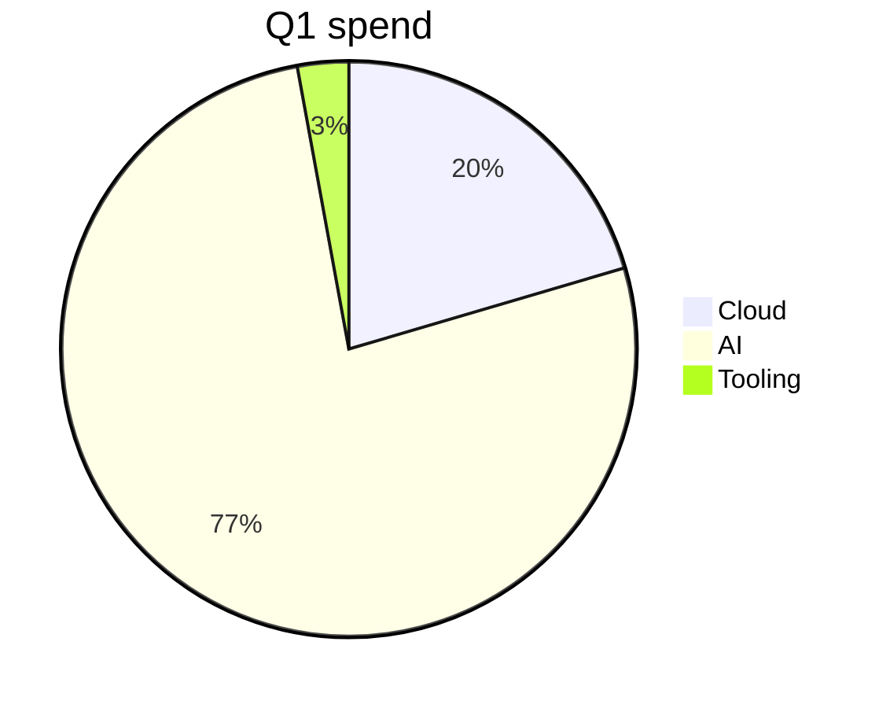
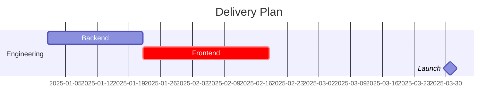
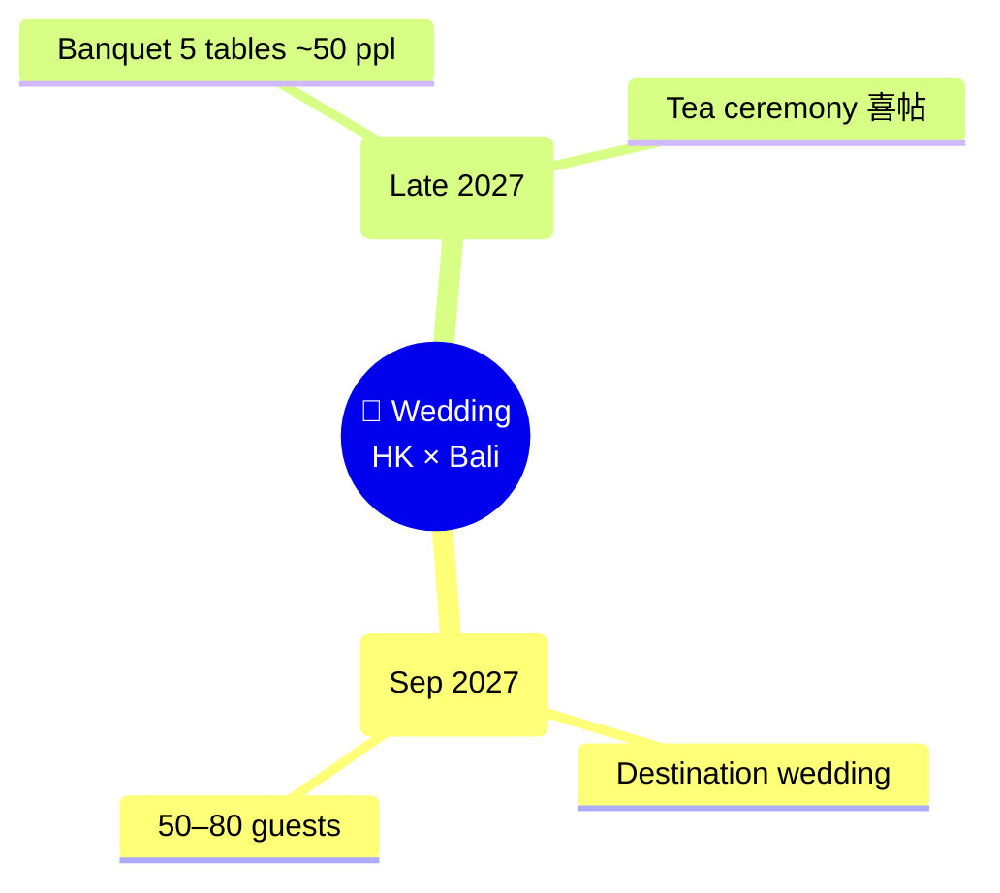

# share--markdown

Turn any markdown into a shareable URL — Cloudflare KV-backed short URLs with a feature-rich SPA viewer (interactive tables, gantt, mind maps, charts, fullscreen diagrams, social-share OG tags, "Add to LLM" selection menu).

## URL output

By default, the script auto-shortens URLs > 1KB via Cloudflare KV. Output is ~45-char URLs like `https://md-share-kut.pages.dev/s/a1b2c3d4` — safe to **include in your response** so the user can click directly.

Long fragment URLs (`--no-short` flag) are still copied to clipboard only — do NOT echo those, they waste tokens.

After running the script with short URL output (default), include the printed URL in your response so the user can click it.

For multi-part `--no-short` output, say "N URLs copied to clipboard" — do not list them.

## Quick Usage

```bash
SCRIPT=~/.claude/skills/share--markdown/scripts/share-md.py

# From file (auto-shortens if URL > 1KB)
python3 $SCRIPT README.md

# From stdin
cat notes.md | python3 $SCRIPT

# Inline text
python3 $SCRIPT --text "# Hello\n\nWorld"

# Update an existing share (requires URL or 8-char key)
python3 $SCRIPT --update https://md-share-kut.pages.dev/s/a1b2c3d4 README.md
python3 $SCRIPT --update a1b2c3d4 README.md

# Skip lint (server defaults to lint-on)
python3 $SCRIPT --no-lint draft.md

# Always shorten / disable shortener
python3 $SCRIPT README.md --always-short
python3 $SCRIPT README.md --no-short

# With stats / open in browser
python3 $SCRIPT README.md --stats
python3 $SCRIPT README.md --open
```

## Rich content support

The viewer renders these block types interactively. Use them in your markdown for the best UX:

### Markdown tables → Tabulator (`<table>` enhancement)

Plain GFM tables are auto-upgraded with **per-column header search**, **sort** (currency-aware: `$1,234.56` parses as float), **filter**, **drag to reorder**, **right-click hide column**, and **localStorage persistence** keyed by table signature. **Inline cell formatting is preserved** — markdown links (`[text](url)`), inline `code`, **bold**, *italic*, and ~~strikethrough~~ render verbatim inside cells. Links open in a new tab (`target="_blank" rel="noopener noreferrer"`). Sort/filter operate on the plain text, so links don't break ordering. No syntax change required:

```markdown
| Page         | Link                                       | Cost      |
|--------------|--------------------------------------------|-----------|
| Q1 Roadmap   | [Open in Notion](https://notion.so/q1)     | $1,200.00 |
| ADR Index    | [Open in Notion](https://notion.so/adrs)   | $0.00     |
```

Currency, percent, number, boolean (`yes/no/✓/✗`), and date columns are auto-detected.

### Mermaid pie / xychart → Chart.js (interactive)

Mermaid `pie` and `xychart-beta` blocks are intercepted and re-rendered with Chart.js (hover tooltips, legend toggle, responsive). No syntax change:

````markdown

````

### Arbitrary charts → ` ```chart ` fence (Chart.js JSON)

For full Chart.js power, use the new `chart` fence with a JSON config:

````markdown
```chart
{
  "type": "line",
  "data": {
    "labels": ["Jan", "Feb", "Mar"],
    "datasets": [{"label": "MAU", "data": [12, 19, 27]}]
  }
}
```
````

Supported types: `line`, `bar`, `pie`, `doughnut`, `polarArea`. Auto-coloring; responsive; full Chart.js v4 options accepted.

### Mermaid gantt → frappe-gantt (better UX)

Mermaid `gantt` blocks are intercepted and rendered with frappe-gantt: **toolbar with view modes** (Hour/Quarter Day/Half Day/Day/Week/Month/Year), **horizontal scroll**, **hover popups**, themed bars (red `crit`, green `done`, amber `milestone`). No syntax change:

````markdown

````

### Mermaid mindmap → markmap (interactive auto-upgrade)

Mermaid's built-in `mindmap` diagram type renders as a static, non-interactive SVG. The viewer **auto-detects mermaid mindmap blocks and re-renders them with the rich markmap library** — same library that powers the `\`\`\`markmap` fence. You get D3-driven pan/zoom, click-to-expand nodes, and fullscreen mode with node search — without changing the source markdown:

````markdown

````

The conversion: each indent step = one nesting level; shape brackets (`((…))`, `(…)`, `[…]`, `{{…}}`) are stripped; `<br/>` becomes a space; the root node becomes an H1, children become nested bullets — then handed off to markmap-lib as if it were a `\`\`\`markmap` block.

### Mind maps → ` ```markmap ` (or `mindmap`) fence

Renders an interactive D3-driven mind map (drag to pan, scroll to zoom, click nodes to expand/collapse). Click anywhere outside a node to open the **fullscreen viewer with node search**:

````markdown
```markmap
# Topic
## Branch A
- Leaf 1
- Leaf 2
## Branch B
- Leaf 3
```
````

### Maps

Interactive multi-day itinerary maps with color-coded routes per day. Routes are computed by OpenRouteService (driving / walking / cycling); if routing fails the map falls back to straight dashed lines between stops.

````markdown
```map
height: 400              # optional, default 400
center: [-122.0, 37.3]   # optional [lng, lat], auto-fit if omitted
zoom: 12                 # optional
days:
  - color: "#3b82f6"
    profile: driving-car        # driving-car | foot-walking | cycling-regular
    stops:
      - { lng: -122.41, lat: 37.78, label: "SFO" }
      - { lng: -121.89, lat: 37.33, label: "San Jose" }
  - color: "#ef4444"
    profile: foot-walking
    stops:
      - { lng: -122.41, lat: 37.78, label: "Ferry Building" }
      - { lng: -122.43, lat: 37.77, label: "Painted Ladies" }
```
````

Markers are clickable (popup with `label`). Coordinates are `lng/lat` only — no place-name geocoding. Limits: ≤50 stops per day, ≤20 days per map.

### Mermaid + markmap → click for fullscreen

Any rendered mermaid diagram or mind map is clickable to open a **fullscreen viewer** with pan/zoom (mouse drag + scroll wheel) and `+`/`−`/`0`/`Esc` keyboard shortcuts. Mind maps add a search box in the toolbar.

## Selection menu (mobile + desktop)

Selecting any text in the rendered markdown reveals a floating menu near the selection with two actions:

- **⤴ Add to LLM** — copies `[page <key>, lines <start>-<end>]\n<selected text>` to clipboard. Paste into an agent to point it at the exact lines of the source markdown to edit.
- **⧉ Copy** — copies the plain selected text.

Line numbers are relative to the saved markdown (including frontmatter) — so the agent can edit the original file directly. Touch-friendly on mobile (≥40px tap targets, viewport-aware positioning).

## Edit existing share — `--update`

Pass a URL or 8-char key to overwrite an existing share. Same `SHARE_MD_TOKEN` auth required. Server replaces the KV entry; viewers see the new content on next load:

```bash
# From URL
python3 $SCRIPT --update https://md-share-kut.pages.dev/s/a1b2c3d4 README.md

# From raw key
python3 $SCRIPT --update a1b2c3d4 README.md
```

`--update` implies `--always-short`; `--no-short` is ignored when set.

## Lint pre-save

The `share-md.py` script invokes a local Node CLI (`scripts/md-lint.mjs`) before uploading. CLI exits with code 2 and prints errors when lint fails:

- **Fenced code block balance** — unclosed ` ``` ` triples
- **Mermaid blocks** — must start with a recognized diagram type; balanced `()` `[]` `{}`
- **Markmap blocks** — must contain at least one heading or list item
- **Tables** — every row must have the same number of columns as the header

Bypass with `--no-lint` (e.g., for drafts or known-good content the linter mis-flags):

```bash
python3 $SCRIPT --no-lint draft.md
```

## OG / Twitter card metadata for rich link previews

When a short URL is opened (e.g., pasted into Slack/Telegram/Twitter/iMessage/Discord/Facebook), the server injects:

- `<title>` — from frontmatter `title:`, else first H1
- `<meta name="description">` and `<meta property="og:description">` — from frontmatter `description:` or `summary:`, else first non-heading paragraph (≤200 chars)
- `<meta property="og:title">`, `<meta property="og:url">`, `<meta property="og:site_name">`, `<meta property="og:type" content="article">`
- `<meta property="og:image">` → **dynamically generated 1200×630 PNG** at `/og/<key>.png` with the title, description, share URL, site brand, and a deterministic gradient background (8 palettes, picked by hashing the share key — same content always gets the same look)
- `<meta property="og:image:width|height|type|alt">`
- `<meta name="twitter:card" content="summary_large_image">` + `twitter:title` / `twitter:description` / `twitter:image`

The PNG is cached at the edge for 7 days (`s-maxage=604800`) since titles rarely change. The `summary_large_image` Twitter card type renders a full-bleed hero image preview — much richer than the text-only `summary` card.

To control the preview, add YAML frontmatter:

```markdown
---
title: Q1 2025 Roadmap
description: Comprehensive plan with budget, timeline, and risks.
---

# Q1 2025 Roadmap
…
```

**Force a fresh preview:** Slack/Telegram/Facebook cache previews aggressively (hours to days). Append `?v=2` (any query string) to the URL when re-sharing to bust their cache. The Cloudflare edge cache also keys on full URL, so the new query string fetches a fresh PNG.

## Encoding Scheme

```
Short URL:    https://md-share-kut.pages.dev/s/<8-char-key>    (~45 chars)
Single part:  https://md-share-kut.pages.dev/#v1.<base64url(gzip(utf8 markdown))>
Multi part:   https://md-share-kut.pages.dev/#v1.NofM.<base64url(gzip(utf8 chunk))>
```

Short URL key = first 8 hex chars of SHA-256(markdown). Deterministic: same content → same key.

- `gzip.compress(text.encode('utf-8'))` — standard gzip format (pako.ungzip compatible)
- `base64.urlsafe_b64encode(data).rstrip(b'=')` — URL-safe, no padding
- Max payload per URL: **28,000 chars** (leaves headroom under Chrome's ~32k limit)
- KV TTL: **sliding 1-year** — refreshed on every read so unread shares prune after 1y of inactivity

## Short URL behavior

- **Default**: auto-shortens when the fragment URL would exceed 1024 chars (configurable via `short_threshold`)
- **`--always-short`**: always shorten regardless of content size
- **`--no-short`**: skip shortener, emit fragment URL (multi-part fallback for large content)
- **`--update`**: implies `--always-short`; replaces an existing key
- Short URLs are printed to stdout — safe to include in Claude responses
- Short URLs content expires after 1 year of inactivity (sliding TTL)

## Multi-part Chunking (--no-short fallback)

When encoded length exceeds 28,000 chars, markdown is split into N chunks:

1. Estimate N = `ceil(encoded_len / 28000)`
2. Split at safe boundaries (priority: headings > blank lines > any non-fence line)
3. Never split inside fenced code blocks (` ``` `) or mermaid blocks
4. Verify each chunk fits; increment N and retry if any chunk overflows

Multi-part output (tty):
```
Part 1/3: https://md-share-kut.pages.dev/#v1.1of3.<encoded>
Part 2/3: https://md-share-kut.pages.dev/#v1.2of3.<encoded>
Part 3/3: https://md-share-kut.pages.dev/#v1.3of3.<encoded>
```

Piped output (one URL per line, no prefix — clean for automation).

## Flag Reference

| Flag | Description |
|------|-------------|
| `file` | Markdown file path (or `-` for stdin) |
| `--text TEXT` | Inline markdown string (`\n` escapes supported) |
| `--base URL` | Override SPA base URL (default from config.json) |
| `--open` | Open first URL in browser (`open` command, macOS) |
| `--copy` | Copy all URLs to clipboard via `pbcopy` (**default: on**, macOS) |
| `--no-copy` | Disable clipboard copy |
| `--stats` | Print size breakdown to stderr |
| `--print-only` | Suppress confirmation footer (URLs only) |
| `--no-short` | Disable shortener, always emit fragment URL |
| `--always-short` | Always shorten, even for tiny content |
| `--short-threshold N` | URL length threshold for auto-shortening (default: 1024) |
| `--update URL_OR_KEY` | Overwrite an existing share by URL or 8-char key (implies `--always-short`) |
| `--no-lint` | Bypass local markdown linting |

## Config

`~/.claude/skills/share--markdown/config.json` (private — do not commit):
```json
{
  "base_url": "https://md-share-kut.pages.dev",
  "api_token": "<secret — stored locally only>",
  "short_threshold": 1024
}
```

- `api_token` enables short URLs. Set in config.json locally; also set as `SHARE_MD_TOKEN` Pages secret in Cloudflare.
- Update `base_url` after deploying your own SPA instance.

## Example Outputs

**Short URL (default for most content):**
```
https://md-share-kut.pages.dev/s/a1b2c3d4
```

**Lint failure (exit code 2):**
```
Markdown failed lint checks:
  • L21: unclosed fenced code block (missing closing ```)
  • L7: mermaid block has unbalanced parentheses (1 open, 0 close)
  • L14: table row has 3 columns but header has 2

Fix the issues or pass --no-lint to bypass.
```

**Multi part (large file, --no-short, piped):**
```
https://md-share-kut.pages.dev/#v1.1of2.H4sI...
https://md-share-kut.pages.dev/#v1.2of2.H4sI...
```

**Stats output (stderr):**
```
raw:        4,231 bytes (148 lines)
gzipped:    1,892 bytes (compression: 44.7%)
encoded:    2,524 chars (base64url)
chunks:     1
url length: 2,565 chars
```

## Rotating MapTiler / ORS keys

Keys are stored as Cloudflare Pages secrets on the `md-share` project and served to the browser via `/api/keys` (cached 1 day at the edge). Both are referrer-restricted in their respective dashboards, so leakage is low-risk; rotate only on suspected abuse.

**Rotate:**

```bash
TOKEN=$(grep '^access_token' ~/.cf/config.toml | sed 's/.*= "\([^"]*\)".*/\1/')
ACCOUNT_ID=fbe46925529a77537b36114bed4e1ae1
NEW_MAPTILER_KEY=...   # from MapTiler dashboard
NEW_ORS_KEY=...        # from openrouteservice.org dashboard

curl -sS -X PATCH \
  -H "Authorization: Bearer $TOKEN" \
  -H "Content-Type: application/json" \
  -d "{\"deployment_configs\":{\"production\":{\"env_vars\":{\"MAPTILER_KEY\":{\"type\":\"secret_text\",\"value\":\"$NEW_MAPTILER_KEY\"},\"ORS_KEY\":{\"type\":\"secret_text\",\"value\":\"$NEW_ORS_KEY\"}}},\"preview\":{\"env_vars\":{\"MAPTILER_KEY\":{\"type\":\"secret_text\",\"value\":\"$NEW_MAPTILER_KEY\"},\"ORS_KEY\":{\"type\":\"secret_text\",\"value\":\"$NEW_ORS_KEY\"}}}}}" \
  "https://api.cloudflare.com/client/v4/accounts/$ACCOUNT_ID/pages/projects/md-share"
```

**Purge the `/api/keys` edge cache** (so browsers pick up new keys within minutes instead of 24h):

```bash
# Get the zone id for pages.dev (one-time)
ZONE_ID=$(curl -sS -H "Authorization: Bearer $TOKEN" "https://api.cloudflare.com/client/v4/zones?name=pages.dev" | python3 -c "import sys,json; print(json.load(sys.stdin)['result'][0]['id'])")

# Purge the keys endpoint
curl -sS -X POST \
  -H "Authorization: Bearer $TOKEN" \
  -H "Content-Type: application/json" \
  -d '{"files":["https://md-share-kut.pages.dev/api/keys"]}' \
  "https://api.cloudflare.com/client/v4/zones/$ZONE_ID/purge_cache"
```

Trigger a new deployment if env vars don't propagate (`gh workflow run ...` or push an empty commit).

## Troubleshooting

**"markdown too large to chunk reasonably"** — content would need >100 parts. Consider splitting the document manually.

**Lint failure** — `share-md.py` runs `scripts/md-lint.mjs` locally before upload and exits with code 2. Fix the reported errors or pass `--no-lint`.

**`--update <key>` fails** — key must be 8 lowercase hex characters; auth token must be valid; payload < 100KB.

**Short URL 404** — KV entry expired (1y of inactivity) or wrong key. Re-run to generate a new short URL.

**Shortener error / fallback to fragment** — check that `api_token` in config.json matches `SHARE_MD_TOKEN` Pages secret. Warning printed to stderr.

**OG preview not updating in Slack/Telegram** — those platforms cache previews aggressively. Append `?v=2` to the URL to bust the cache, or wait 1–24 hours.

**Decoding fragment URLs manually:**
```python
import gzip, base64
frag = url.split('#')[1]          # e.g. "v1.H4sI..."
data = frag.split('.', 1)[1]      # strip "v1."
# For multi-part: frag.split('.', 2)[2]
data += '=' * (-len(data) % 4)    # restore padding
md = gzip.decompress(base64.urlsafe_b64decode(data)).decode('utf-8')
```
