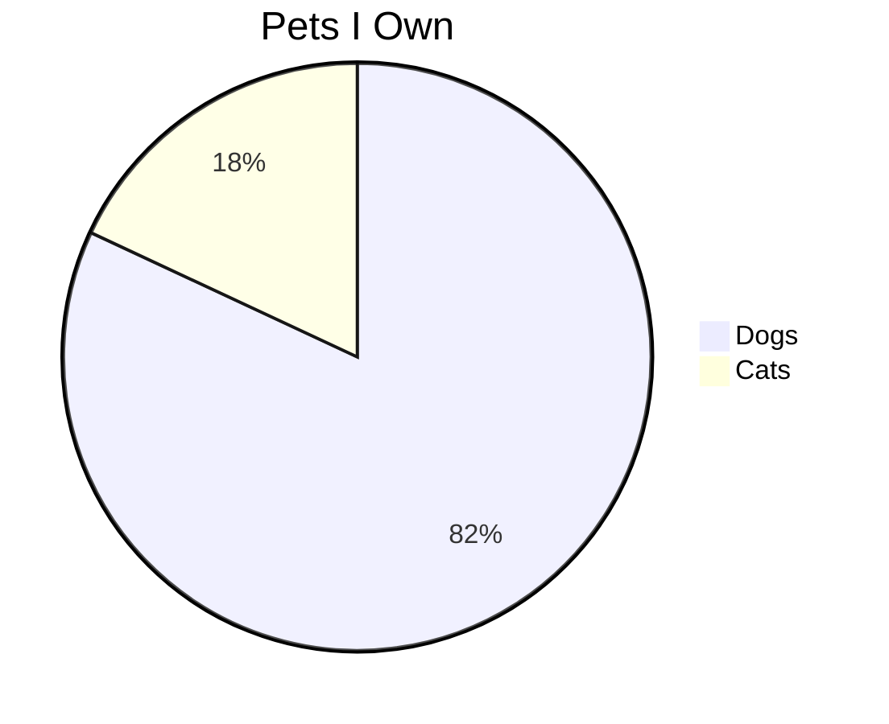

# Smoke Test Document (Updated Title)

This is an updated version of the smoke test markdown document, used to verify the update function of the md-share CLI tool.

| Header 1 | Header 2 |
| -------- | -------- |
| Value A  | Value B  |
| Value C  | Value D  |
