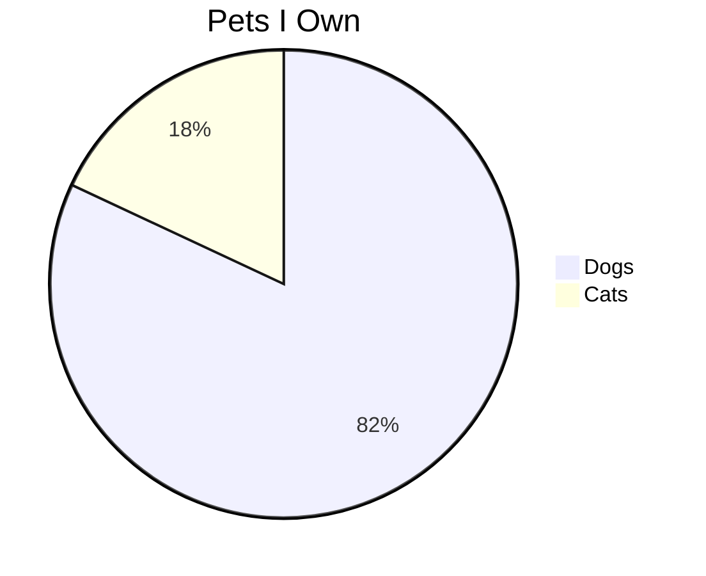

# Smoke Test Document

This is a small markdown document used to verify acceptance commands for the md-share CLI tool.

| Header 1 | Header 2 |
| -------- | -------- |
| Value A  | Value B  |
| Value C  | Value D  |
